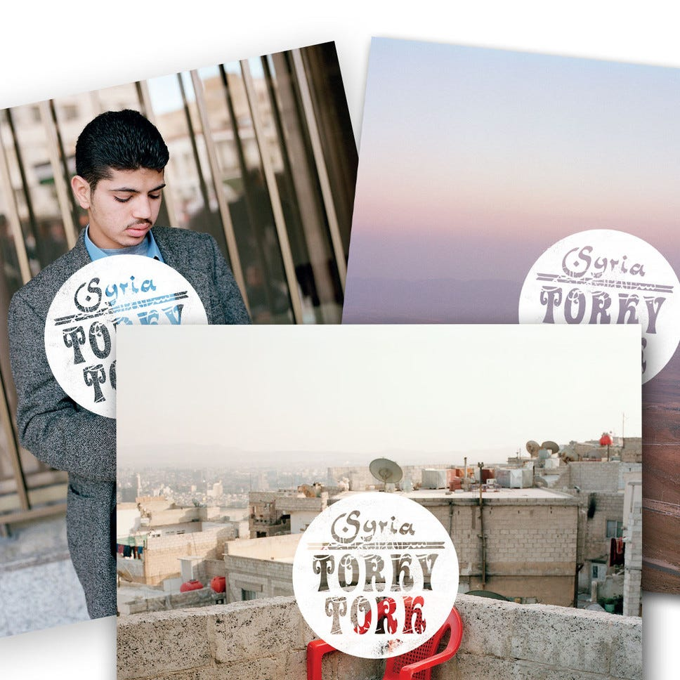
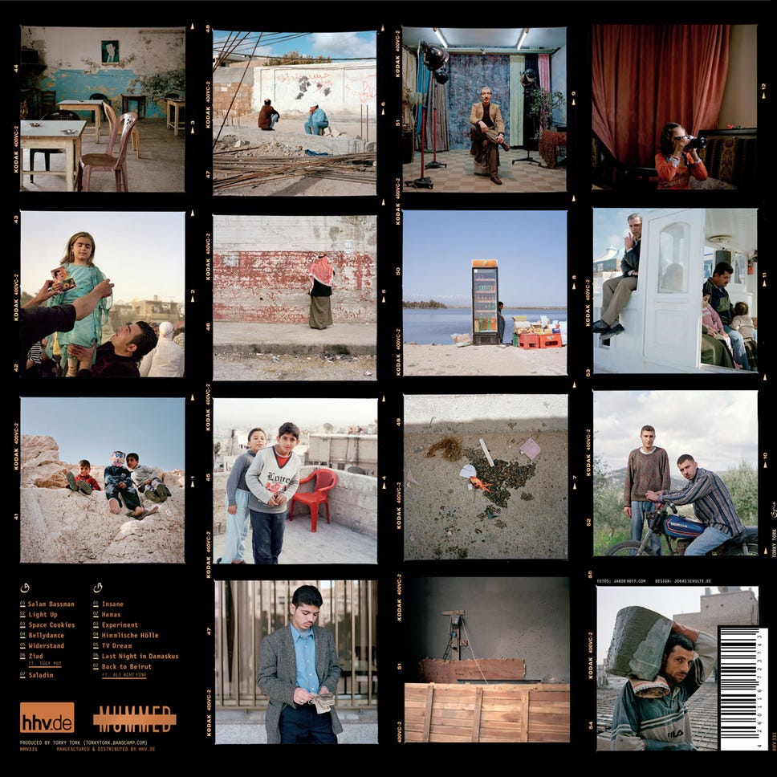
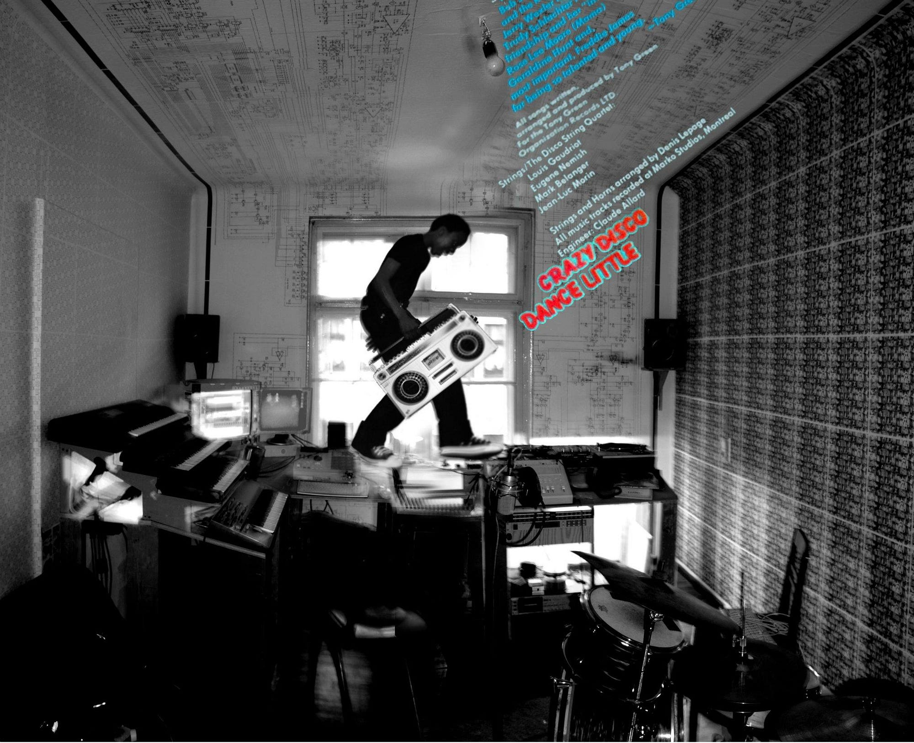

The joy of seeing technological environments going vintage after years. How beeing a net-label pioneer helped to bring donations to syrian refugees and a recod alive.

[@torkytork](http://twitter.com/torkytork) [@hhv](http://twitter.com/hhv) @ashrafrap  
#freesyria #nowar #noborders #opensource #selfpublishing #vinyl

In 2009, _Jakob Hoff_ aka _Torky Tork,_ who is not only a brilliant beat maker, but also a photographer with a passion for humanitarian issues around the globe and the middle east, finished an album called “_Syria_”. His journeys have taken him to Syria, Libanon and Indonesia so far. His mission is to dig into micro culture and find the stories behind the mainstream news that are polarizing our collective and individual ideas about people living in war zones, ecological “catastrophies” and the borders of what we call the progressive world. His eyes and ears are lead by tiny indicators. Lead by emotions. Discovering a record never heard before and long forgotten in stores and basements that know no time, he gets to talk about their heritage, the people that recorded that music, the people that toured around. It’s the stories of the collectors, the stories of the musicians and the people and doctrines that preserved this music onto plastic discs that lead Torky Tork to the next digging ground. Thanks to HHV another record collector may also own a photostudio for yet another story to be told.

All of this wouldn’t have been possible without his tour guides, may it be Ashraf Rap (You will find his rap featured on C3 “Himmliche Hoelle” literally heavenly hell) whom he travelled to Libanon with, yet another album to be discovered ‘ Janoub ‘allah, or was it Ryan Hassan Malik, a photographer himself. Both of his old fellows are German of Syrian and Lebanese decent. Without their help and the help of their families it would have been much harder to dig that deep into a world most of us fear to even travel too. The pictures we know are those of German military journalists with helmets, intellectual reading glasses and cavlar vests standing stiff infront of bomb clouds on the horizon and bombed out houses. In Jakob Hoff’s there is another reality, a much warmer — the home of people, who’s families if possible excaped to countries like Germany, those that stayed to preserver the spirit. The images show anger and tired faces, but also there is pride about making this country a living oasis. A fridge in the middle of the desert is replacing the well that gives waters lively energy. Yet, I remember when Jakob Hoff exhibited those pictures before in some Villa in Berlin, who cares, more importantly, the scenaries were printed on large hanging banners, transporting the viewer into his mind palast. The photos of people became present amongst the visiters. a child watching how a Judas cross of oil was burned on the streets.

Backside of Syria HHV331_1, HHV331_2, HHV331_3

The anger becomes understandable, yet his pictures do not in any case show polarize a political madness. They show the anger of people against political symbols, and how thousand of years of Christianity, Judaism and Islam have not been able to deal with the thing that matters most. PEOPLE — In religion there is no people. There is only systems and believes and interest.

> Oil, power, building walls.  
> Idiocrazy — fueled by western and eastern money and power thirsting mogulats.

Torky Tork has been a founding member and kind supporter of the Shalom Salon collective. It’s origins come from a diverse little barbershop gallery club WG in Weimar, where people from any kind of nationality or political or religious background met peacefully to exchange ideas on common ground. Just like it had been done if the barbershop, was still serving it’s original purpose. When you go to the barber to shave, you trust him/her with your life, yet, the time consuming and social act takes time to talk about the world. This is what we did back than. Invited Palastinian Hamas from Jericho for exhibitions and talks, Polish artists, Gastarbeiter Italian Antifa, and intellectuals from the university, held movie screenings of American blockbusters on 8mm short editions and debatted about the soccer World cup.

> A place, we lifed and worked and humped in. A true Saloon!

The idea lifed on. Shalom Salon started a radio show on Bauhaus.fm 106.6 broadcasting from Erfurt to Jena and over a webstream and hours of material were produced. Torky Tork was not the most skilled technical engineer, yet the most active contributer with more than 10 hours of beats and mixtapes produced in under two years. Together with Anatol Atonal he shaped the sound of Shalom Salon, yet never doctrinating it. Anything was possible. We released and hosted whatever from whereever by whoever wanted to truely express themselves.

Why did we publish open source and what made it possible, now in the retrospective? Remember, that was back in 2006 when we started — the music industry was still selling CD (\*wtf is that?) and the internet was nothing more than forums and an enthusiasts exploring the possibilities of digital publishing. Video streaming was unthinkable and webradios followed the spirit of pirate radios. You needed a nerd to hack the freaking linux server to do what you wanted. Explain it to the DJ and try to keep him motivated during the black outs.

Suprisingly enough Torky Tork was the first of us to put out his releases parallel to our very underattended HTML webpage via Torrents. The German Madlib he labelled the files, and eventually we had traffic! No money made, no money paid. We debatted heavily about copyrights, especially due to the fact that his and _Anatol Atonals_ music was primarily ripped of from the genius of past times. Something controversially new to the rest of us, who were live musicians and had not much of a problem fluting in a tune unrecognizable. Weimar has been before in 1999 founding place of the biggest and first German proper net-label _Tokyo Dawn_ and pioneer Heidelberg Techno Producer _Move D_, some radical thinkers in the experimental radio at the uni, that later on were replaced by a CDU aligned Deutschland Funk broadcasting potato, that killed all spirit of exploration. We were lucky to have still been able to see that transition, otherwise loads of the shows (yes, we pushed the limits sending silence for closely up to 30 seconds), random political statements, smoking weed broadcasting, from the kitchen or toilet onto FM, doing a fake raga broadcast from Friedrichstrasse on Christopher Street day and so on, would have never been possible. Of course we went to local bar Falken afterwards and got the together with other radio makers for a debate over up to 20 beers, but first of all, we felt like anything is possible in this media, and we didn’t give a shit about a mainstream agenda. It felt very very free, no money, but free to talk about what ever came to our mind.

We followed the net-label scene and released under a Creative Commons License first, but in around 2011 radically changed the policy together with [_Upitup Records_](http://www.upitup.com), changed our terms. We released everything under Public Domain, while Upitup Records released their own license [_CopyrightPlus_](http://www.upitup.com/tracky/newalbum/CopyrightPlus.html). The far ends of the possibility chain.

> **Anekdote 1:**
>
> We had a 10 hours marathon and Anatol was in the studio driving the show. He played a new **Dejoe** Mixtape (first ever Shalom Salon party was hosting deejoe so not unfamiliar in Ymar) and I couldn’t help it — sneaked outside, called the studio landline and put up the best Berlin accent I was able to imagine. I claimed to be Dejoe and was saying thank you to Anatol for playing “my” tape. A few seconds afterwards Anatol comes out in the auditorium totally excited and said: “Guys, you wouldn’t believe who just called! Dejoe, guys. He is listing to the stream from Berlin. Wow! I go in and will ask over the internet to have him call again. I put him live guys!” Imagine how hard it was to keep silent for us. So he does it. Just minutes later I sneak out again, calling once more and of course going live and giving props in the name of dejoe. Dejoe, if you read this please forgive me, but it was too funny. Guess I told you the story before anyhow.

We were also the only people broadcasting to the station at that time from their very own selfmade studio. This freedom of speech, this freeform to produce without any fixed agenda, this is what made us abondon traditional publication methods. And of course it is way to difficult if you just want to produce and have people hear your stuff to press a vinyl, a technology from the begining of audio recording. Back then we were jealous of people that released on vinyl, yet we were doing okay and we were sure much more people internationally were listening to our stuff. Quite motivating was the monthly server log reading session and we imagined how those people in America think about **the German Madlib!** \*grin

> Anekdote 2:
>
> We sold some radio plays to WDR by Anatol & Birgit Kempker, yet retained the right to publish it our selves.
>
> Something that gave the executives some stomach aches, yet on an artistic level it was impossible for them to reject our request. A true milestone for us.

Torky Tork didn’t give up exploring what it is like to self-promote and stick with a crew of freaks that wants to squeeze the internet. We didn’t do the most popular music. Instrumental beat music is a niché genre. And let’s not talk about the experimental stuff we did, but runing it on the web it still is a niche, yet a global one is bigger and more rewarding that any local dubstep saxonian dialect rapping rapgida possy. [_Rapohnelizenz_](http://www.rapohnelizenz.com) was born. _Jonas Schulte_ started doing the artworks (he did so for Syria too), Torky contributed photos for covers and interviews, and _Ashraf Rap_ was runing the web war on spamm and recruited like-minded guys from Berlin such as Gerraet from the Cutcannibalz, and Kova to help the blog, write and push the content. The motivation was simple — more interaction, more digging and the talents we found didn’t release music on vinyl either. There was enthusiasts around the globe recording old sample records and uploading their beats on myspace and soundcloud.

> Shalom Salon was sort of functioning as a techical container. Myself I was in Asia during the launch and quite surprised about the rapid “success”.

Within one year, Rapohnelizenz had become like the 12th most frequented music blog in Germany at that time. In some of the statistics _Sueddeutsche Zeitung Musik_ was tailing one spot behind us. Amazing. And also during this time and even before we tied bounds with musicians, DJs and activists around the globe. Some of us never meeting them, but when ever we had the chance to travel anywhere, there was open arms, a bed or couch to stay and a gig to play. I deejayed Rapohnelizenz tunes around Korea, China and Japan with always fresh unreleased stuff by Torky Tork and Anatol Atonal in the dropbox.

# An amazing time — but what changed?

The time Rapohnelizenz started, Bandcamp came up. Bandcamp took the concept of Microsites with a player and download variants, that most Net-Labels were using to promote their music. Net-labels were a very geeky bunch of people, because it was so freaking nerdy to put up a release and there was some radicals in the scene that wanted to use the chance to stir some confusing and changing the name of the artists and the tracks programmatically with every other initalized download. So basically archiving was difficult. When I arrived in Weimar in 2004 the radio legacy producers gave me about 300 hours of noise radio shows in ogg format and Mp3 on CDs in 96kbps. I believe there is still about 4 gigabytes of unheard Shalom Salon shows somewhere on a harddrive of mine or in the University backlog.

Maintaing the catalog was our biggest challange, because of viruses, providing a standardized yet flexible format for uploading and displaying the content. We were trying to release pictures along side the album, or MIDI files or audio visual as well. Bandcamp made it possible to release quicker. Suddenly Torky Tork and the others were able to do more shit alone without my help or other friends help. I had a catalog software scaning our ftp folders for info files and packaging it into these microsites written by our friend Henning Frede. A beautiful one button interface tool, yet easily breaking and easy to hack.

So the guys now were able to publish their own music and promote it on their own blog. A dream come true. And what was best, donations rolled in, that helped to pay our servers. On our own pages, and that was a dilema for all net-labels, donation via paypal was very untrustworthy. What worked was burned CDr’s with self-made silkscreen prints. We had an open payment policy, between 3–5 or less or more. Once the free bandcamp accounts reached their download limits the Shalom Salon servers got accessed and we continued pushing the content from their for free.

We quickly bound ties with [_Raw Tapes_](http://rawtapesrecords.com) from Tel Aviv — idiological, stylewise and spiritwise. And of course because they sort of wondered what our name was about.

This is the irony, it’s taking a heavy topic that we didn’t create, and being playful with it. Taking it with ease to come to new ideas. Being respectful — being open for influences, being open for others.

What might have happened to “Syria” by Torky Tork, if we had decided to go through the process of registering with the GEMA back in 2006 and putting Syria out for a handful of people on a very limited vinyl, maybe CD edition? Digital distribution on your own website was forbidden, so our friends over seas wouldn’t be our friends today, or itunes charged them for listening to something they don’t know anything about.

Just speaking for myself, but I believe it is in all of our souls, and I am super proud that with all the change in sound that we have gone through, we still are able to keep those releases alive. May they do their good whereever they are needed. They are tools for communication and discours. Nothing to be put into chains. There shall be no borders for ideas. There shall be no borders for people. Fight the system even if it is just that little human dignity inside of you. Common sense that makes the difference.

We are also super thankful, that the lovely people at HHV got the ability to make its music happening on the originally intended media in such a very social way. And hopefully these beats will spread and give cheer to people even after our last servers have gone out of service!

This is the uncertain story of a uncertain story to be continued!

[Buy the limited edition now via HHV.de](http://www.hhv.de/shop/de/artikel/torky-tork-syria-versions-1-3-bundle-403840) and support Moabit’s refugees coming to Berlin!

[_Original article published on Medium in 2015_](https://medium.com/@shalomsalon/review-torky-tork-syria-re-issued-by-hhv-how-an-open-source-album-came-to-life-years-after-its-d45a15a467e7#.fy572lknb)
