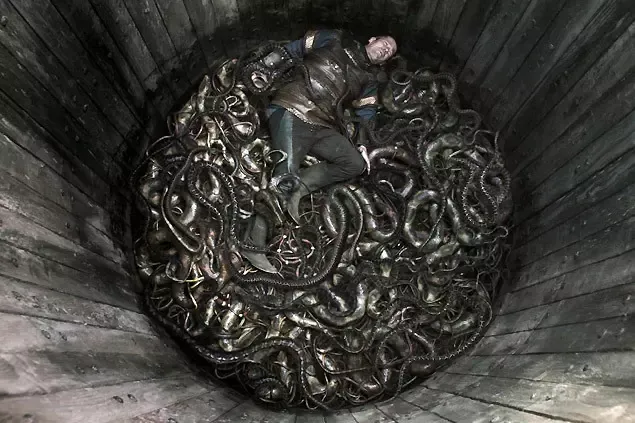

The injured blue shark on Mallorca’s beach made me think. Is an increased global wealth a healthy motor for a functioning ecosystem? Affordable shark fins causes literally some sort of genocide. Are you kidding me, 100 million sharks killed each year? And that’s only sharks. About time that I seriously review my eating habits. Didn’t our mama tell us a less diverse ecosystem is unhealthy, and vulnerable to even the slightest changes in procedure?

Snake pit scene from Vikings

Why do I write about this? I like how this observation can be adopted to developments in healthy cultural environments, too. If we streamline our beliefs the ship gets easier to sink into a tank full of sharks. (beautiful metaphor here)

I believe humanity is trying to succeed at the following:

- Getting rid of the sharks in the shark tank instead of giving up rocking our chair too hard.
- If all sharks are dead and all men are fat, start space colonies and grow new sharks there.

Sounds very reasonable to me. I like ambitious projects.

Here is another related anecdote I tend to quote a lot lately. Did you ever wonder why we don’t have to clean our car’s windshields anymore during the summer trip? Bugs, flies, etc. having a hard time in “clean öko deutschland”, there presence declined by 80% since the 80s. As we continue to rationalize and streamline our industrial agriculture we force ourselves in homogeneous voids. in social science similar tendencies have been named nationalism, racism, and come with a connotation of supremacy.

The original article was published on Medium.

[Original Article on Medium](https://medium.com/@shalomsalon/notes-on-shark-fin-soup-genocide-7bf02d4b4add)
