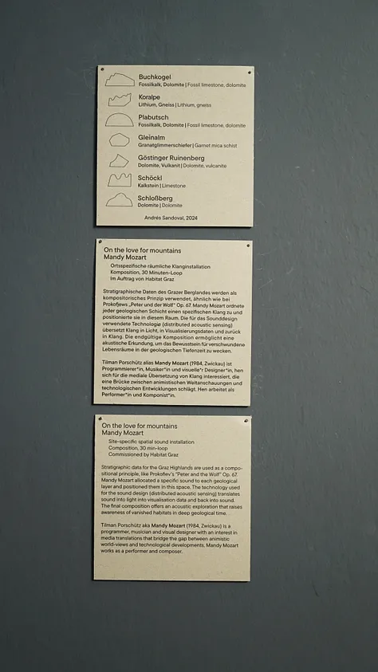

Interviews with Daniela Brasil, Caroline Boehm and Monique Fessel.

I am super happy to share with you this tiny sidetrack of mine about a topic dear to my heart, or could I say, DEER to my heart. Co-existing is not only something we have to learn with other human, but relearn with any species. In the show we explored possibilities, realities and utopias and how the urban space is not ours alone.I had the pleasure to produce a 6 Channel Audio Installation “Love For Mountains” and two podcasts with fictional cartoon characters.The exhibit started May last year and is running until 26th of February. I was stuck in work at my residency in Westbahnstudio Vienna, so apologize for the late review.

https://www.grazmuseum.at/ausstellung/habitat-graz/

https://youtu.be/fGYpTHSOTZ0

If you are around make sure to visit the exhibit which got extended until the 26th of May.

I will add the mentioned podcasts in the following days on Substack, my blog or whereever you are listening to your podcasts:

TUESDAY, 14. 1. 2024 at 10 AM
“Interview mit einem Mammutbaum” (Interview with a Sequoia) 

WEDNESDAY, 15. 1. 2025 at 10 AM 
“Picknick für eine Krähe” (Picknick for a crow) 